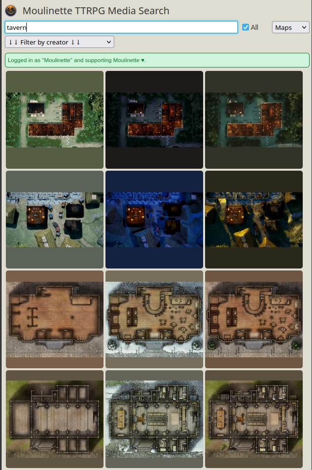

# Moulinette TTRPG Media Search (Browser Extension)

This module is part of the [Moulinette suite](https://www.moulinette.cloud) of tools designed to simplify the search and use of content for game masters, helping them prepare their game sessions and even manage their games in real time.

The module is designed as browser extension, tested on [Mozilla Firefox](https://www.mozilla.org/firefox) and [Chromium](https://www.chromium.org). Quickly and easily search the content from creators you support and browse assets from all [available creators](https://assets.moulinette.cloud/marketplace/creators) on Moulinette Cloud.

#### Features
* Browse, search, download from [Moulinette Cloud](https://assets.moulinette.cloud/marketplace/creators). (1)
* Drag and drop assets directly into web-based applications, such as Roll20 or FoundryVTT.
* Available content: maps, images, sounds, music, PDFs. 

*(1) : Accessing content from creators requires supporting both them and Moulinette. The usage rights for the content are specific to each creator.*

  

*(the above screenshots feature premium assets from [Tom Cartos](https://www.patreon.com/tomcartos))*

## <a name=""/>Screenshots

   

## <a name="install"/>Install the Moulinette Browser Extension (MBE)

* [MBE for Mozilla Firefox](https://addons.mozilla.org/en-CA/firefox/addon/moulinette)
* [MBE for Google Chrome](https://chromewebstore.google.com/detail/moulinette/jobgolcfpmhokjccabjfgnelphonlaeg)

## <a name="support"/>Support me on Patreon

If you like my work and want to support me, consider subscribing to Moulinette!
* [Moulinette on Patreon](https://www.patreon.com/moulinette)
* [Moulinette on Stripe](https://assets.moulinette.cloud/pricing) (requires Patreon authentication)

You can also join [Moulinette Discord](https://discord.gg/xg3dcMQfP2)
